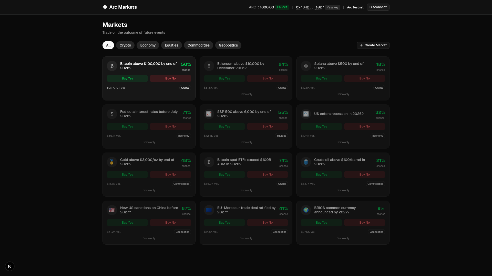

# Arc Prediction Markets

A prediction market platform built on [Arc Testnet](https://arc.network/) using [UMA's Optimistic Oracle V2](https://docs.uma.xyz/protocol-overview/how-does-umas-oracle-work) for trustless, decentralized resolution. Users connect a wallet, mint ARCT test tokens, deposit collateral to create Long (YES) and Short (NO) position tokens, and trade them through a built-in AMM. The platform ships with a live Bitcoin market and a grid of demo markets across Crypto, Economy, Equities, Commodities, and Geopolitics categories - and anyone can **create new custom markets on-chain** directly from the UI.

Resolution is handled by UMA's Optimistic Oracle V2: anyone can propose an outcome, and if no one disputes it within the liveness period, the market settles. Disputed proposals escalate to UMA's DVM (Data Verification Mechanism) for arbitration.

Since UMA's oracle infrastructure is not natively deployed on Arc Testnet, the deploy script bootstraps the entire UMA ecosystem on-chain - Finder, IdentifierWhitelist, AddressWhitelist, Store, MockOracleAncillary, and OptimisticOracleV2.



## Table of Contents

- [Prerequisites](#prerequisites)
- [Getting Started](#getting-started)
- [How It Works](#how-it-works)
- [UMA Optimistic Oracle V2 Integration](#uma-optimistic-oracle-v2-integration)
- [Automated Market Maker (AMM)](#automated-market-maker-amm)
- [Market Lifecycle](#market-lifecycle)
- [Creating Custom Markets](#creating-custom-markets)
- [Environment Variables](#environment-variables)
- [Project Structure](#project-structure)

## Prerequisites

- **Node.js v18+** - Install via [nvm](https://github.com/nvm-sh/nvm)
- **A wallet** - either:
  - **MetaMask** (or any injected EVM wallet) - connected to **Arc Testnet** (Chain ID `5042002`), or
  - **Circle Passkey Wallet** - browser-based biometric authentication via WebAuthn (no extension needed). Requires a [Circle developer account](https://console.circle.com/) for the client key and URL.

    > **Emulating passkeys in the browser:** If your browser does not support hardware passkeys (or you're developing without a biometric device), you can enable a virtual authenticator in DevTools:
    > 1. Open **Developer Tools** (F12)
    > 2. Go to the **WebAuthn** tab (in Chromium-based browsers)
    > 3. Check **"Enable virtual authenticator environment"**
    > 4. Configure the virtual authenticator:
    >    - **Protocol**: `ctap2`
    >    - **Transport**: `internal`
    >    - **Supports resident keys**: `Yes`
    >    - **Supports user verification**: `Yes`
    >    - **Supports large blob**: `No`
    >
    > This creates a software-based authenticator that emulates biometric authentication, allowing passkey registration and login to work without physical hardware.

- **Arc Testnet USDC** - used for gas fees only. Obtain from the [Circle faucet](https://faucet.circle.com/)
- **ARCT tokens** - the collateral token for this market. Freely mintable via the UI faucet button or the `TestnetERC20.allocateTo()` contract function.

## Getting Started

1. Clone the repository and install dependencies:

   ```bash
   git clone git@github.com:circlefin/arc-prediction-markets.git
   cd arc-prediction-markets
   npm install
   ```

2. Set up environment variables:

   ```bash
   cp .env.example .env.local
   ```

   Edit `.env.local` and fill in your deployer private key and (optionally) Circle credentials (see [Environment Variables](#environment-variables)). The Arc Testnet RPC URL is pre-filled.

   > **Note:** Deployment requires a **non-custodial wallet** (e.g. MetaMask) whose private key you can export. Custodial wallets like Circle passkey wallets do not expose private keys and cannot be used for deployment. The Circle wallet integration is for end users interacting with the deployed contracts via the frontend.

   > **Design note - private key vs. mnemonic:** The [UMA tutorial](https://docs.uma.xyz/developers/optimistic-oracle/in-depth-tutorial-event-based-prediction-market#deployment) uses a **mnemonic** (via `@uma/common`'s `getMnemonic()` and the `hardhat-deploy` plugin) to derive deployer accounts. This branch uses a **raw private key** instead, which removes the `@uma/common` and `hardhat-deploy` dependencies in favor of a single imperative deploy script (`scripts/deploy.ts`). The trade-off is fewer dependencies and a simpler setup for single-deployer testnet use, at the cost of HD wallet derivation and the declarative multi-step deployment framework. For production or multi-chain deployments, consider switching to the mnemonic-based approach.

3. Compile and deploy the smart contracts:

   ```bash
   npm run compile
   npm run deploy
   ```

   The deploy script:
   1. Deploys the full UMA infrastructure (Timer, Finder, IdentifierWhitelist, AddressWhitelist, Store, TestnetERC20, MockOracleAncillary, OptimisticOracleV2)
   2. Wires the Finder, whitelists the `YES_OR_NO_QUERY` identifier and ARCT collateral
   3. Mints 100,000 ARCT to the deployer
   4. Deploys the EventBasedPredictionMarket and initializes it (requesting a price from the OO)
   5. Deploys the PredictionMarketAMM and seeds it with 1,000 ARCT
   6. Writes all deployed addresses to `.env.local`

4. Start the development server:

   ```bash
   npm run dev
   ```

   The app will be available at `http://localhost:3000`.

## How It Works

- Built with [Next.js](https://nextjs.org/) App Router and [wagmi](https://wagmi.sh/) + [viem](https://viem.sh/) for wallet interactions
- **Multi-market platform**: the home page displays a categorized grid of markets (Crypto, Economy, Equities, Commodities, Geopolitics). One live on-chain Bitcoin market is deployed by default; the remaining demo markets show static prices. Users can **create new on-chain markets** via a dialog in the UI, which deploys fresh contracts and seeds liquidity automatically.
- **Dual wallet support**: users can connect via MetaMask (injected wallet) or a Circle passkey wallet (WebAuthn biometric authentication with smart account abstraction via [`@circle-fin/modular-wallets-core`](https://www.npmjs.com/package/@circle-fin/modular-wallets-core)). A unified `useContractWrite` hook abstracts the differences so all market/AMM/OO actions work identically with either wallet type.
- Two Solidity contracts work together: `EventBasedPredictionMarket` manages the core lifecycle (initialization, position creation, redemption, OO callbacks, settlement) and `PredictionMarketAMM` provides a constant-product trading interface on top
- Collateral is ARCT (Arc Test Token, 18 decimals) - a freely mintable TestnetERC20 deployed as part of the UMA infrastructure. Users can mint tokens via the **Faucet** button in the navbar.
- Markets are resolved through UMA's Optimistic Oracle V2, not by a contract owner
- Styled with [Tailwind CSS](https://tailwindcss.com) and components from [shadcn/ui](https://ui.shadcn.com/)
- Arc Testnet uses USDC as native gas - no need for separate ETH for transaction fees

## UMA Optimistic Oracle V2 Integration

### Why deploy UMA infrastructure on Arc Testnet?

UMA's oracle infrastructure (Optimistic Oracle, Finder, DVM, etc.) is only deployed on Ethereum, Polygon, Optimism, Arbitrum, Base, Blast, Story, and Avalanche (plus select testnets). Arc Testnet (chain ID `5042002`) is not among them - so we deploy the entire UMA ecosystem ourselves.

### Deployed UMA contracts

| Contract | Purpose |
| --- | --- |
| **Timer** | Testable time source for controlled testing |
| **Finder** | Central registry - maps interface names to contract addresses |
| **IdentifierWhitelist** | Whitelists supported price identifiers (e.g. `YES_OR_NO_QUERY`) |
| **AddressWhitelist** | Whitelists approved collateral tokens |
| **Store** | Manages oracle fees (set to 0 for testnet) |
| **TestnetERC20 (ARCT)** | Freely mintable 18-decimal token used as collateral and bond currency |
| **MockOracleAncillary** | Testnet DVM substitute - admin can push prices for dispute resolution |
| **OptimisticOracleV2** | The core oracle: request → propose → dispute → settle |

### How resolution works

1. **Market initialization**: The deploy script calls `initializeMarket()`, which requests a price from the OO with the `YES_OR_NO_QUERY` identifier, 1-minute liveness, and a configurable proposer bond.

2. **Propose**: Anyone can propose a resolution via `oo.proposePrice()`:
   - `1e18` = YES (Bitcoin exceeded $100K)
   - `0` = NO
   - `5e17` = Undetermined

3. **Liveness period**: The proposal remains open for dispute for the configured liveness time (1 minute by default on testnet).

4. **Dispute** *(optional)*: If someone disagrees, they call `oo.disputePrice()`, posting a matching bond. The dispute escalates to the MockOracleAncillary (DVM substitute), and the market re-requests a price with a fresh timestamp.

5. **Settlement**: After liveness expires without dispute, anyone calls `oo.settle()`. The OO calls back into the market's `priceSettled()` function, setting `receivedSettlementPrice = true` and computing the `settlementPrice`.

6. **Redeem**: Users call `settle(longTokens, shortTokens)` on the market to burn their tokens for ARCT based on the outcome.

### Event-based mode

The market uses the OO's **event-based mode** (`setEventBased()`), which means:
- On dispute, the DVM votes based on the **proposal timestamp** (not the original request timestamp)
- The market callback re-requests with a new timestamp, allowing multiple dispute rounds

### Callbacks

The market implements two OO callbacks:
- `priceSettled()` - receives the resolved price, maps it to `settlementPrice`, and finalizes the market
- `priceDisputed()` - re-requests the price with a fresh timestamp when a proposal is disputed

## Automated Market Maker (AMM)

The `PredictionMarketAMM` contract sits on top of the prediction market and provides continuous trading of Yes/No positions using a **constant product formula** (`x * y = k`).

### How trading works

**Buying**: When a user calls `buyYes(amount)`, the AMM pulls ARCT, mints a Yes+No pair via the market, swaps the unwanted No tokens into the pool's reserve, and sends the user all the Yes tokens (minted + swapped).

**Selling**: When a user calls `sellYes(amount)`, the AMM pulls Yes tokens, swaps them for No tokens via constant product, pairs them to redeem ARCT from the market, and sends the user the ARCT.

### Pricing

- **Yes price** = `reserveNo / (reserveYes + reserveNo)`
- **No price** = `reserveYes / (reserveYes + reserveNo)`
- Prices always sum to 1.00. A 2% fee is applied on every swap.

### Preview functions

| Function | Returns |
| --- | --- |
| `calcBuyYes(amount)` | How many Yes tokens you would receive |
| `calcBuyNo(amount)` | How many No tokens you would receive |
| `calcSellYes(yesAmount)` | How much ARCT you would receive for selling Yes |
| `calcSellNo(noAmount)` | How much ARCT you would receive for selling No |
| `getYesPrice()` / `getNoPrice()` | Current prices (18-decimal fixed point, 0 to 1e18) |
| `getReserves()` | Current `(reserveYes, reserveNo)` |

## Market Lifecycle

| Step | Action | Description |
| --- | --- | --- |
| 1 | **Deploy** | Deploy script deploys all UMA infra + market + AMM |
| 2 | **Initialize** | Deploy script requests price from OO (pays proposer reward) |
| 3 | **Trade** | Users buy/sell Yes/No tokens via the AMM |
| 4 | **Propose** | Anyone proposes a resolution price to the OO (stakes a bond) |
| 5 | **Liveness** | 1-minute window for disputes (configurable) |
| 6 | **Settle Oracle** | After liveness, anyone calls `oo.settle()` to finalize |
| 7 | **Settle Tokens** | Users burn tokens for ARCT based on the outcome |

**Settlement outcomes:**

| Proposed Price | Long (YES) Value | Short (NO) Value |
| --- | --- | --- |
| YES (1e18) | 1 ARCT per token | 0 ARCT per token |
| NO (0) | 0 ARCT per token | 1 ARCT per token |
| Undetermined (5e17) | 0.5 ARCT per token | 0.5 ARCT per token |

## Creating Custom Markets

In addition to the default Bitcoin market deployed by the deploy script, users can create new prediction markets directly from the UI:

1. Click the **"Create Market"** button on the home page
2. Enter a yes/no question (e.g., "Will ETH flip BTC by 2027?")
3. The server-side API (`/api/create-market`) deploys a new `EventBasedPredictionMarket` and `PredictionMarketAMM` pair on-chain, initializes the market with the OO, and seeds the AMM with 1,000 ARCT of liquidity
4. The new market appears in the grid and is fully tradeable

Custom markets are stored in `data/markets.json` and served via the `/api/markets` endpoint. To wipe all custom markets (the default Bitcoin market is unaffected):

```bash
npm run reset
```

> **Note:** Market creation requires the server to have access to the deployer `PRIVATE_KEY` (set in `.env.local`), since contracts are deployed from the server side.

## Environment Variables

All environment variables live in `.env.local`. The deploy script automatically writes contract addresses after a successful deployment.

| Variable | Purpose |
| --- | --- |
| `PRIVATE_KEY` | Deployer wallet private key |
| `NEXT_PUBLIC_ALCHEMY_RPC_URL` | Alchemy RPC URL (used by both Hardhat and the frontend) |
| `NEXT_PUBLIC_MARKET_ADDRESS` | Deployed EventBasedPredictionMarket address (auto-written) |
| `NEXT_PUBLIC_AMM_ADDRESS` | Deployed PredictionMarketAMM address (auto-written) |
| `NEXT_PUBLIC_ARCT_ADDRESS` | Deployed ARCT (TestnetERC20) address (auto-written) |
| `NEXT_PUBLIC_OO_V2_ADDRESS` | Deployed OptimisticOracleV2 address (auto-written) |
| `NEXT_PUBLIC_FINDER_ADDRESS` | Deployed Finder address (auto-written) |
| `NEXT_PUBLIC_TIMER_ADDRESS` | Deployed Timer address (auto-written) |
| `NEXT_PUBLIC_MOCK_ORACLE_ADDRESS` | Deployed MockOracleAncillary address (auto-written) |
| `NEXT_PUBLIC_CIRCLE_CLIENT_KEY` | Circle modular wallets client key (for passkey wallet) |
| `NEXT_PUBLIC_CIRCLE_CLIENT_URL` | Circle modular wallets API URL (for passkey wallet) |

## Project Structure

```
uma-prediction-market/
├── app/                                    # Next.js App Router pages
│   ├── layout.tsx
│   ├── page.tsx                            # Market grid with category filtering
│   ├── market/[address]/page.tsx           # Individual market detail page
│   ├── api/
│   │   ├── create-market/route.ts          # POST - deploy new market + AMM on-chain
│   │   └── markets/route.ts               # GET - list user-created markets
│   ├── providers.tsx
│   └── globals.css
├── components/                             # React components (modular subdirectories)
│   ├── actions/                            # Market action components
│   │   ├── ActionTxStatus.tsx
│   │   ├── ApproveSection.tsx              # Approve collateral spending
│   │   ├── CreateSection.tsx               # Create Long/Short position tokens
│   │   ├── MarketActions.tsx               # Approve/Create/Redeem/Settle tabs
│   │   ├── RedeemSection.tsx               # Redeem tokens after settlement
│   │   └── SettleSection.tsx               # Settle market via OO callback
│   ├── market/                             # Market display components
│   │   ├── MarketDetail.tsx                # Market detail with oracle status + portfolio
│   │   ├── MarketHeader.tsx                # Market title and metadata header
│   │   ├── MarketStatusSection.tsx         # Oracle and settlement status display
│   │   ├── PortfolioSection.tsx            # User position / portfolio breakdown
│   │   └── ProbabilityBar.tsx              # Visual probability indicator
│   ├── trading/                            # Trading interface components
│   │   ├── BuyTab.tsx                      # Buy Yes/No tokens tab
│   │   ├── OutcomeSelector.tsx             # Yes/No outcome picker
│   │   ├── ResolveTab.tsx                  # OO propose/dispute/settle tab
│   │   ├── SellTab.tsx                     # Sell tokens tab
│   │   ├── TradingPanel.tsx                # Buy/Sell/Resolve tabbed panel
│   │   └── TxStatus.tsx                    # Transaction status indicator
│   ├── wallet/                             # Wallet connection components
│   │   ├── ConnectDialog.tsx               # Wallet selection dialog
│   │   ├── ConnectWallet.tsx               # Wallet connect button + ARCT faucet
│   │   └── CopyableText.tsx               # Click-to-copy address display
│   ├── CreateMarketDialog.tsx              # Dialog to create custom on-chain markets
│   ├── MarketCard.tsx                      # Market card for home page grid
│   ├── MarketInfo.tsx                      # Compact market info card
│   ├── Navbar.tsx
│   ├── TokenBalances.tsx
│   └── ui/                                 # shadcn/ui primitives (button, card, dialog, tabs, etc.)
├── contracts/                              # Solidity smart contracts
│   ├── EventBasedPredictionMarket.sol      # OO V2-integrated prediction market
│   └── PredictionMarketAMM.sol             # Constant product AMM
├── contexts/
│   ├── WalletContext.tsx                    # Dual-wallet state (MetaMask + Circle passkey)
│   └── MarketAddressContext.tsx            # Per-market address provider for hooks
├── data/
│   └── markets.json                        # User-created markets (managed by API)
├── hooks/
│   ├── useMarket.ts                        # Re-exports from hooks/market/
│   ├── useAMM.ts                           # Re-exports from hooks/amm/
│   ├── useContractWrite.ts                 # Unified write hook for both wallet types
│   ├── amm/                                # AMM hook modules
│   │   ├── useAMMApprovals.ts              # AMM token approval state & actions
│   │   ├── useAMMCalc.ts                   # Preview calculations (calcBuy/calcSell)
│   │   ├── useAMMState.ts                  # Reserves, prices, balances
│   │   └── useAMMTrade.ts                  # Buy/sell execution
│   └── market/                             # Market hook modules
│       ├── helpers.ts                      # Shared formatting & parsing helpers
│       ├── useMarketActions.ts             # Create positions, redeem, settle
│       ├── useMarketCardData.ts            # Data for MarketCard grid display
│       ├── useMarketState.ts               # Market parameters & settlement state
│       ├── useOracleActions.ts             # OO propose/dispute/settle actions
│       ├── useOracleState.ts               # Oracle request & proposal state
│       └── useTokenBalances.ts             # Long/Short/ARCT balance queries
├── lib/
│   ├── contracts.ts                        # Legacy barrel - re-exports from lib/contracts/
│   ├── contracts/                          # Contract definitions (modular)
│   │   ├── addresses.ts                    # Deployed contract addresses from env vars
│   │   ├── types.ts                        # OracleState enum & shared types
│   │   └── abis/                           # ABI definitions per contract
│   │       ├── amm.ts                      # PredictionMarketAMM ABI
│   │       ├── erc20.ts                    # ERC20 / TestnetERC20 ABI
│   │       ├── market.ts                   # EventBasedPredictionMarket ABI
│   │       ├── oracle.ts                   # OptimisticOracleV2 ABI
│   │       └── timer.ts                    # Timer ABI
│   ├── circle.ts                           # Circle passkey transport & client helpers
│   ├── errors.ts                           # Error parsing & user-friendly messages
│   ├── markets.ts                          # Static market grid (1 real + 11 demo) + types
│   ├── wagmi.ts                            # Wagmi + Arc Testnet chain config
│   └── utils.ts                            # Utility functions
├── public/                                 # Static assets
├── scripts/
│   ├── deploy.ts                           # Deploys UMA infra + market + AMM, seeds liquidity
│   └── reset-markets.ts                    # Wipes user-created markets from data/markets.json
├── components.json                         # shadcn/ui configuration
├── eslint.config.mjs                       # ESLint configuration
├── hardhat.config.ts                       # Arc Testnet network & compiler settings
├── next.config.ts                          # Next.js configuration
├── package.json                            # All dependencies & scripts
├── postcss.config.mjs                      # PostCSS / Tailwind CSS configuration
├── tsconfig.json                           # TypeScript configuration
└── .env.example                            # Environment variable template
```

## Security & Usage Model

This sample application:
- Targets Arc Testnet only
- Uses UMA's Optimistic Oracle V2 for trustless resolution, with a MockOracleAncillary as DVM substitute on testnet
- ARCT tokens are freely mintable - not suitable for production use without replacing with a real collateral token
- Is not intended for production use without modification
